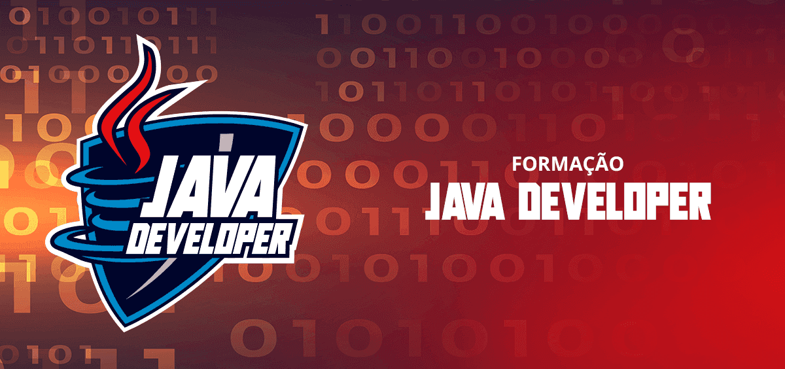

# Formação Java Developer 

Bem-vindo(a) ao meu repositório do Formação Java Developer! Aqui vou acompanhar e armazenar todo o meu progresso nas aulas deste Formação da Digital Innovation One (DIO).

# Descrição
Este é o meu repositório pessoal, criado com o propósito de registrar todo o conhecimento adquirido durante o Formação Java Developer da DIO. Aqui, encontrarei os arquivos e projetos referentes a cada módulo e aula, permitindo que eu acompanhe o meu aprendizado de forma organizada e sistemática.

# Sobre o Formação
O Formação Java Developer da DIO é uma formação completa que me proporciona a oportunidade de aprender Java desde o básico até o uso avançado do Spring Framework. Com a orientação dos melhores especialistas da DIO, o Formação oferece uma jornada de aprendizado emocionante e desafiadora.